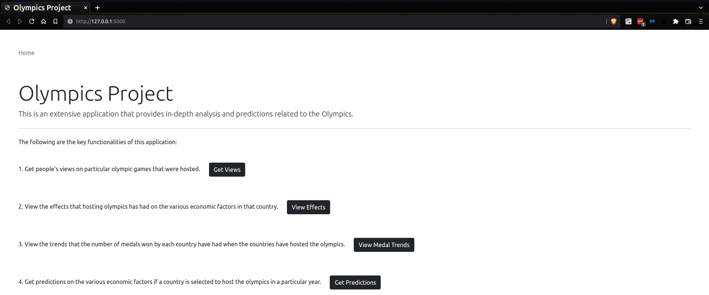

# Olympics: Analysis and Prediction



## Introduction:

Welcome to our project on the Olympics! This project aims to perform a detailed analysis on the past data of olympics
conducted and also provide some predictions to help decide which country would be able to be the next host.

## How it works:

We scraped data pertaining to the Olympics from various websites such as Olympedia, World Bank API, Wikipedia, etc. Then
we performed a detailed analysis based on this data for past Olympic games played, as well as the number of medals won
each year by participating countries and also created a predictor that would be able to give an estimate of the
economical standing of the countries if they decided to host the Olympics in their country.

## How to run the application:

1. Setup and use a python virtual environment:
    1. `python3 -m pip install --user virtualenv`
    2. `python3 -m venv env`
    3. `source env/bin/activate`
    4. `pip install -R requirements.txt`
2. Run the [server.py](web/server.py):
    1. `python3 server.py`
3. This will give you a URL which you can visit to use the application.

## Overview of the repo:
```
. 
├── data/ 
│     └── This is the main directory for data used in our project. 
├── docs/ 
│     └── This contains the markdown files used in our documentation. 
├── research/ 
│     └── This contains various research papers used in our domain research.
├── scripts/ 
│     └── This contains all the scripts for data scraping, analysis and modeling. 
└── web/ 
      └── This contains all the files used in the UI and for backend.
```

## Detailed Documentation:

You can find more details about the steps followed in this project.

1. [Data Scraping](docs/scrapers.md)
2. [Data Analysis](docs/analysis.md)
3. [Predictor Modeling](docs/predictor.md)
4. [Olympic Analysis Results](https://htmlpreview.github.io/?https://github.com/srakhe/olympics/blob/main/web/static/analysis/olympic_analysis/olympic_analysis.html)
5. [Medal Analysis Results](https://htmlpreview.github.io/?https://github.com/srakhe/olympics/blob/main/web/static/analysis/medal_analysis/medal_analysis.html)
6. [Sentiment Analysis Results](docs/sentiment_results.md)
7. [Predictor Results](docs/predictor_results.md)
8. [Application Screenshots](docs/screenshots.md)